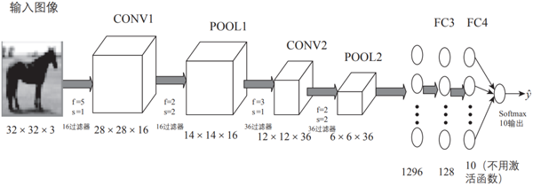
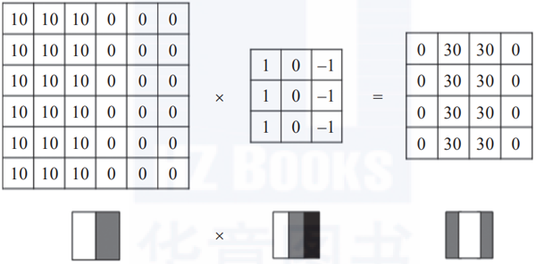
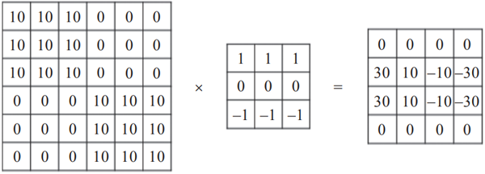
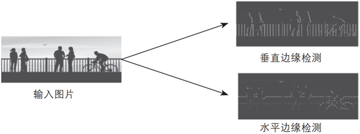
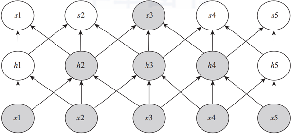
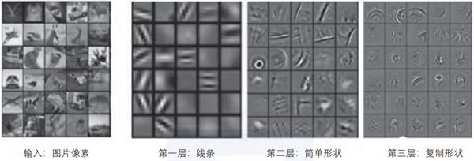
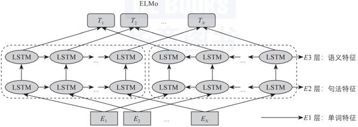
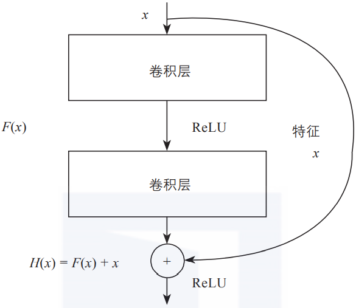

# CNN

CNN(Convolutional Neural Networks), 卷积神经网络。可以完成

- 目标检测
- 图像分类和检测
- 超分辨率重构
- 医学任务
- 无人驾驶

网络整体架构分为: 输入层,卷积层,池化层,全连接层。

## 01 卷积网络的一般架构

卷积神经网络（Convolutional Neural Network，CNN）是一种前馈神经网络，最早在1986年BP算法中提出。1989年LeCun将其运用到多层神经网络中，但直到1998年LeCun提出LeNet-5模型，神经网络的雏形才基本形成。

在接下来近十年的时间里，对卷积神经网络的相关研究一直处于低谷，原因有两个：一是研究人员意识到多层神经网络在进行BP训练时的计算量极大，以当时的硬件计算能力完全不可能实现；二是包括SVM在内的浅层机器学习算法也开始崭露头角。

2006年，Hinton一鸣惊人，在《科学》上发表名为Reducing the Dimensionality of Data with Neural Networks的文章，CNN再度觉醒，并取得长足发展。2012年，CNN在ImageNet大赛上夺冠。

2014年，谷歌研发出20层的VGG模型。同年，DeepFace、DeepID模型横空出世，直接将LFW数据库上的人脸识别、人脸认证的正确率提高到99.75%，超越人类平均水平。

卷积神经网络由一个或多个卷积层和顶端的全连接层（对应经典的神经网络）组成，同时也包括关联权重和池化层（Pooling Layer）等。与其他深度学习架构相比，卷积神经网络能够在图像和语音识别方面给出更好的结果。这一模型也可以使用反向传播算法进行训练。

相比其他深度、前馈神经网络，卷积神经网络可以用更少的参数获得更高的性能。图3-1就是一个简单的卷积神经网络架构。

▲图3-1 卷积神经网络示意图

如图3-1所示，该架构包括卷积神经网络的常用层，如卷积层、池化层、全连接层和输出层；有时也会包括其他层，如正则化层、高级层等。接下来我们就各层的结构、原理等进行详细说明。

图3-1是用一个比较简单的卷积神经网络对手写输入数据进行分类的架构示意图，由卷积层、池化层和全连接层叠加而成。下面我们先用代码定义这个卷积神经网络，然后介绍各部分的定义及实现原理。

## 02 增加通道的魅力

增加通道实际就是增加卷积核，它是整个卷积过程的核心。比较简单的卷积核或过滤器有垂直边缘过滤器（Vertical Filter）、水平边缘过滤器（Horizontal Filter）、Sobel过滤器（Sobel Filter）等。

这些过滤器能够检测图像的垂直边缘、水平边缘，增强图片中心区域权重等。下面我们通过一些图来简单演示这些过滤器的具体作用。

### 1. 垂直边缘检测

垂直边缘过滤器是3×3矩阵（注意，过滤器一般是奇数阶矩阵），特点是有值的是第1列和第3列，第2列为0，可用于检测原数据的垂直边缘，如图3-2所示。

▲图3-2 过滤器对垂直边缘的检测

### 2. 水平边缘检测

水平边缘过滤器也是3×3矩阵，特点是有值的是第1行和第3行，第2行为0，可用于检测原数据的水平边缘，如图3-3所示。

▲图3-3 过滤器对水平边缘的检测

以上两种过滤器对图像水平边缘检测、垂直边缘检测的效果图如图3-4所示。

▲图3-4 过滤器对图像水平边缘检测、垂直边缘检测后的效果图

上面介绍的两种过滤器比较简单，在深度学习中，过滤器除了需要检测垂直边缘、水平边缘等，还需要检测其他边缘特征。

那么，如何确定过滤器呢？过滤器类似于标准神经网络中的权重矩阵W，W需要通过梯度下降算法反复迭代求得，所以，在深度学习中，过滤器也需要通过模型训练得到。卷积神经网络计算出这些过滤器的数值，也就实现了对图片所有边缘特征的检测。

## 03 加深网络的动机

加深网络的好处包括减少参数的数量，扩大感受野（Receptive Field，给神经元施加变化的某个局部空间区域）。

感受野是指卷积神经网络每一层输出的特征图（Feature Map）上的像素点在输入图片上映射的区域大小。通俗点说，感受野是特征图上每一个点对应输入图上的区域，如图3-5所示。

▲图3-5 增加网络层扩大感受野示意图

由图3-5可以看出，经过几个卷积层之后，一个特征所表示的信息量越来越多，一个s3表现了x1、x2、x3、x4、x5的信息。

此外，叠加层可进一步提高网络的表现力。这是因为它向网络添加了基于激活函数的“非线性”表现力，通过非线性函数的叠加，可以表现更加复杂的内容。

不同层提取图像的特征是不一样的，层数越高，表现的特征越复杂，如图3-6所示。

▲图3-6 不同层表现不同的特征

从图3-6可以看出，前面的层提取的特征比较简单，是一些颜色、边缘特征。越往后，提取到的特征越复杂，是一些复杂的几何形状。这符合我们对卷积神经网络的设计初衷，即通过多层卷积完成对图像的逐层特征提取和抽象。

在ELMo预训练模型中也会存在类似情况，如图3-7所示，随着层数的增加，其表示的内容越复杂、抽象。

▲图3-7 ELMo模型

## 04 残差连接

网络层数增加了，根据导数的链式法则，就容易出现梯度消散或爆炸等问题。例如，如果各网络层激活函数的导数都比较小，那么在多次连乘后梯度可能会越来越小，这就是常说的梯度消散。对于深层网络来说，传到浅层，梯度几乎就没了。

在解决这类问题时，除了采用合适的激活函数外，还有一个重要技巧，即使用残差连接。图3-8是残差连接的简单示意图。

▲图3-8 残差连接示意图

如图3-8所示，图中的每一个导数都加上了一个恒等项1，dh/dx = d(f + x)/dx = 1 + df/dx。此时就算原来的导数df/dx很小，误差仍然能够有效地反向传播，这也是残差连接的核心思想。