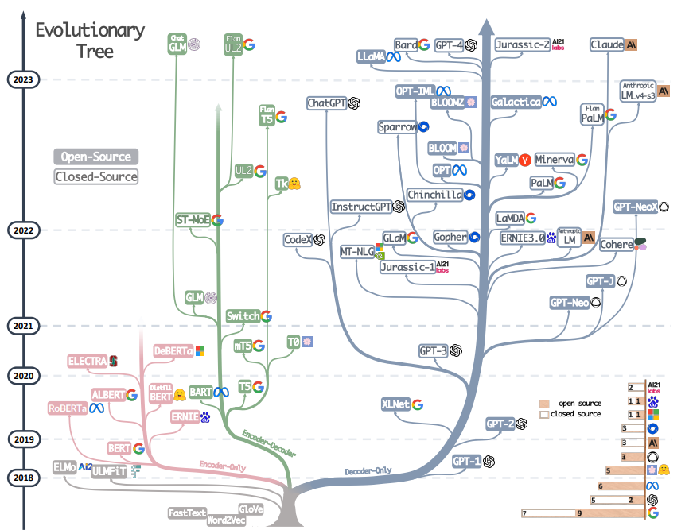

# 深度学习历史

## CNN

卷积神经网络（Convolutional Neural Network，CNN）是一种前馈神经网络，最早在**1986**年BP算法中提出。1989年LeCun将其运用到多层神经网络中，但直到1998年LeCun提出LeNet-5模型，神经网络的雏形才基本形成。

在接下来近十年的时间里，对卷积神经网络的相关研究一直处于低谷，原因有两个：一是研究人员意识到多层神经网络在进行BP训练时的计算量极大，以当时的硬件计算能力完全不可能实现；二是包括SVM在内的浅层机器学习算法也开始崭露头角。

**2006**年，Hinton一鸣惊人，在《科学》上发表名为Reducing the Dimensionality of Data with Neural Networks的文章，CNN再度觉醒，并取得长足发展。**2012**年，CNN在ImageNet大赛上夺冠。

**2014**年，谷歌研发出20层的VGG模型。同年，DeepFace、DeepID模型横空出世，直接将LFW数据库上的人脸识别、人脸认证的正确率提高到99.75%，超越人类平均水平。

2015年深度学习领域的三巨头LeCun、Bengio 、Hinton联手在Nature上发表综述对DeepLearning进行科普。2016年3月阿尔法狗打败李世石。

### 一、1986年~1998年

　　这段时间里是CNN的雏形阶段，主要包括BP算法的提出、BP算法在多层神经网络模型中的应用、LeNet-5模型的正式定型。

### 1.1 BP算法的提出

　　BP算法是在1986年由Rumelhart在《Learning Internal Representations by Error Propagation》一文中提出，如果你的论文中提到了BP算法，那这篇文章似乎是非引用不可的，它目前的引用量是19043次：

### 1.2 基于BP算法的CNN雏形

　　在BP算法提出3年之后，嗅觉敏锐的LeCun选择将BP算法用于训练多层卷积神经网络来识别手写数字，这可以说是CNN的雏形，具体参见文章《Backpropagation applied to handwritten zip code recognition》，这是卷积神经网络这一概念提出的最早文献，目前应用量为1594次：

### 1.3 LeNet-5模型的最终定型

　　 所有研究CNN的都必然知道LeNet-5模型，这是第一个正式的卷积神经网络模型：但你知道它是在什么时候被正式提出来的吗？在1998年，作者还是LeCun，文章《Gradient-based learning applied to document recognition》，引用量4832次：

​	   至此，LeNet-5模型的提出标志着CNN的正式成型，不幸的是接下来这个技术就被打入冷宫，原因如上文所说，它不仅吃设备，而且好的替代品还很多。

### 二、2006年

　　这一年可以说是DeepLearning觉醒的一年，标志就是Hinton在Science发文，指出“多隐层神经网络具有更为优异的特征学习能力，并且其在训练上的复杂度可以通过逐层初始化来有效缓解”。这篇惊世骇俗之作名为《Reducing the dimensionality of data with neural networks》，目前引用量3210次：

　　至此，在GPU加速的硬件条件下，在大数据识别的应用背景下，DeepLearning、CNN再次起飞。

### 三、2012年~2014年

这段时间卷积神经网络的相关研究已经进行的如火如荼，学术文献呈井喷式层出不穷，具有代表性的我认为有两个：2012年的ImageNet大赛和2014年的DeepFace、DeepID模型。

### 3.1 ImageNet竞赛上CNN的一鸣惊人

　　可以说，2012年CNN在ImageNet竞赛中的表现直接奠定了它的重要地位，两个第一，正确率超出第二近10%，确实让人大跌眼镜。在文献《Imagenet classification with deep convolutional neural networks》详细介绍了相关的结构模型以及比赛结果，这篇文献的作者是Hinton，目前引用量4412次：

### 3.2 DeepFace、DeepID

在2012年CNN一炮打响之后，其应用领域再也不只局限于手写数字识别以及声音识别了，人脸识别成为其重要的应用领域之一。在这期间DeepFace和DeepID作为两个相对成功的高性能人脸识别与认证模型，成为CNN在人脸识别领域中的标志性研究成果。DeepFace由Taigman等人提出，发表在2014年的CVPR上，具体信息参见文章《DeepFace: Closing the Gap to Human-Level Performance in Face Verification》，目前引用量548：

至于DeepID，这是由香港中文大学汤晓鸥教授的研究团队提出，于2014年连发三箭，箭箭都正中靶心，分别是《Deep Learning Face Representation from Predicting 10,000 Classes》、《Deep learning face representation by joint identification-verification》、《Deeply learned face representations are sparse, selective, and robust》 目前引用量都在100~200次之间。需要强调的一点是作者在第三篇文章中对卷积神经网络的内部结构进行了分析，试图从理论上诠释CNN的强大特征提取能力，这是学者第一次试图去探索CNN的本质属性，史无前例。

### 四、2015年~至今

　　卷积神经网络自从2006年再度走进人们的视线，发展到现在已经快有十个年头。2015年深度学习领域的三巨头LeCun、Bengio 、Hinton在Nature上发表一篇综述，系统的总结了深度学习的发展前世今生，文章写得通俗易懂，全文几乎都没有什么公式，是一篇科普性较强的文章，个人觉得研究深度学习的人员都应该去读一读，题目也很简洁，就叫《Deep Learning》，2015年发表，目前引用量已达321次： 

在2016年，CNN再次给人们一个惊喜：谷歌研发的基于深度神经网络和搜索树的智能机器人“阿尔法狗”在围棋上击败了人类，更惊喜的是谷歌在Nature专门发表了一篇文章来解释这个阿尔法狗，估计很多人都不知道，文章名字叫做《Mastering the game of Go with deep neural networks and tree search》，由于刚刚发表，引用次数仅为29次：

## RNN

循环神经网络(Recurrent Neural Network, RNN)是一类以序列(sequence)数据为输入，在序列的演进方向进行递归(recursion)且所有节点(循环单元)按链式连接的递归神经网络(recursive neural network)。对循环神经网络的研究始于二十世纪80-90年代，并在二十一世纪初发展为深度学习(deep learning)算法之一，其中双向循环神经网络(Bidirectional RNN, Bi-RNN)和长短期记忆网络(Long Short-Term Memory networks，LSTM)是常见的循环神经网络。

**1982年**，美国加州理工学院物理学家John Hopfield发明了一种单层反馈神经网络Hopfield Network，用来解决组合优化问题。这是最早的RNN的雏形。**1986年**，另一位[机器学习的泰斗Michael I.Jordan定义了Recurrent的概念，提出Jordan Network。1990年，美国认知科学家Jeffrey L.Elman对Jordan Network进行了简化,并采用BP算法进行训练，便有了如今最简单的包含单个自连接节点的RNN模型。但此时RNN由于梯度消失(Gradient Vanishing)及梯度爆炸(Gradient Exploding)的问题，训练非常困难，应用非常受限。直到**1997年**，瑞士人工智能研究所的主任Jurgen Schmidhuber提出长短期记忆(LSTM)，LSTM使用门控单元及记忆机制大大缓解了早期RNN训练的问题。同样在1997年，Mike Schuster提出双向RNN模型(Bidirectional RNN)。这两种模型大大改进了早期RNN结构，拓宽了RNN的应用范围，为后续序列建模的发展奠定了基础。此时RNN虽然在一些序列建模任务上取得了不错的效果，但由于计算资源消耗大，后续几年一直没有太大的进展。

2010年，Tomas Mikolov对Bengio等人提出的feedforward Neural network language model(NNLM)进行了改进，提出了基于RNN的语言模型(RNN LM)，并将其用在语音识别任务中，大幅提升了识别精度。

在此基础上Tomas Mikolov于**2013年**提出了大名鼎鼎的word2vec。与NNLM及RNNLM不同，word2vec的目标不再专注于建模语言模型，而是专注于如何利用语言模型学习每个单词的语义化向量(distributed representation)，当然distributed representation概念最早要来源于Hinton 1986年的工作。word2vec引发了深度学习在自然语言处理领域的浪潮，除此之外还启发了knowledge representation，network representation等新的领域。

另一方面，**2014年**Bengio团队与Google几乎同时提出了seq2seq架构，将RNN用于机器翻译。没过多久，Bengio团队又提出注意力Attention机制，对seq2seq架构进行改进。自此机器翻译全面进入到神经机器翻译(NMT)的时代，NMT不仅过程简单，而且效果要远超统计机器翻译的效果。目前主流的机器翻译系统几乎都采用了神经机器翻译的技术，除此之外，Attention机制也被广泛用于基于深度学习的各种任务中。

近两年，相关领域仍有一些突破性进展，2017年，Facebook人工智能实验室提出基于卷积神经网络的seq2seq架构，将RNN替换为带有门控单元的CNN，提升效果的同时大幅加快了模型训练速度。此后不久，Google提出Transformer架构，使用Self-Attention代替原有的RNN及CNN，更进一步降低了模型复杂度。在词表示学习方面，Allen人工智能研究所**2018年**提出上下文相关的表示学习方法ELMo，利用双向LSTM语言模型对不同语境下的单词，学习不同的向量表示，在6个NLP任务上取得了提升。OpenAI团队在此基础上提出预训练模型GPT，把LSTM替换为Transformer来训练语言模型，在应用到具体任务时，与之前学习词向量当作特征的方式不同，GPT直接在预训练得到的语言模型最后一层接上Softmax作为任务输出层，然后再对模型进行微调，在多项任务上GPT取得了更好的效果。

不久之后，Google提出BERT模型，将GPT中的单向语言模型拓展为双向语言模型(Masked Language Model)，并在预训练中引入了sentence prediction任务。BERT模型在11个任务中取得了最好的效果，是深度学习在NLP领域又一个里程碑式的工作。BERT自从在arXiv上发表以来获得了研究界和工业界的极大关注，感觉像是打开了深度学习在NLP应用的潘多拉魔盒。随后涌现了一大批类似于“BERT”的预训练(pre-trained)模型，有引入BERT中双向上下文信息的广义自回归模型XLNet，也有改进BERT训练方式和目标的RoBERTa和SpanBERT，还有结合多任务以及知识蒸馏(Knowledge Distillation)强化BERT的MT-DNN等。这些种种，还被大家称为BERTology。

## Transformer

2017年，谷歌团队首先提出Transformer模型。该团队将Transformer概括为一句话：“Attention is All You Need.”但单单看这句话，人们并不能对Transformer模型建立直观的理解与认知。

