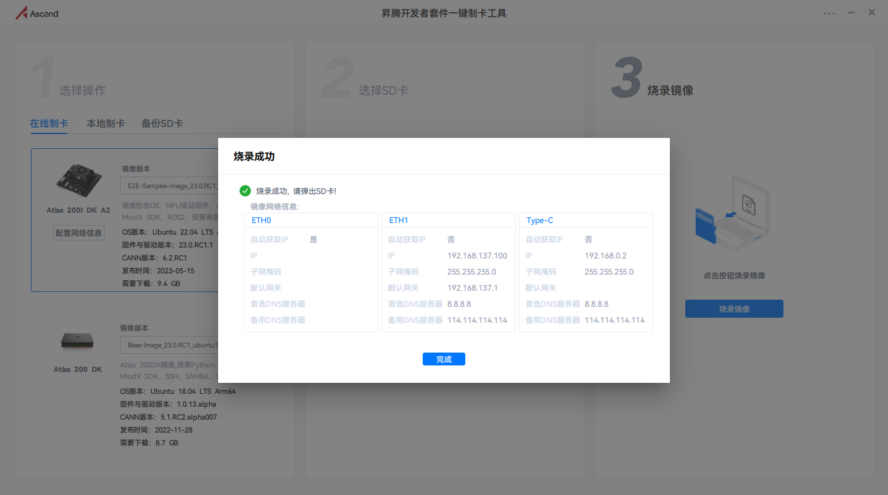
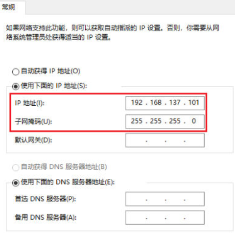
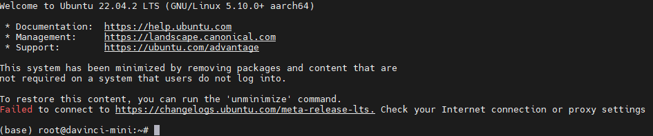
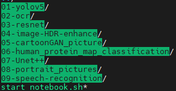
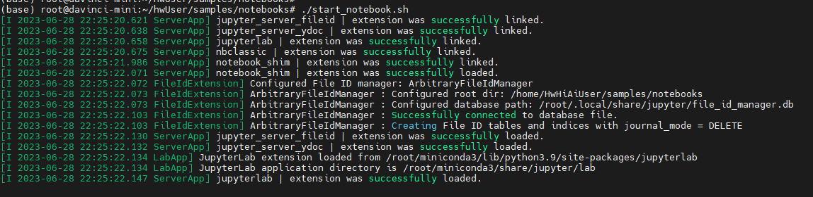
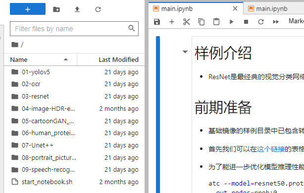
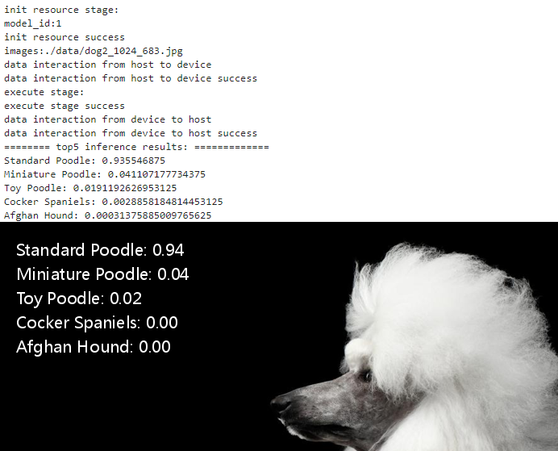

A200DK-A2开发套件上手初体验

> 总体感受：轻松上手，简单易用，算力有些美中不足。

##  1.拿到板子


## 2.制卡并启动

1. 参考官网的[手册](https://www.hiascend.com/document/detail/zh/Atlas200IDKA2DeveloperKit/23.0.RC1/qs/qs_0001.html)，下载 [获取制卡工具“Ascend-devkit-imager_*{version}*_win-x86_64.exe”](https://ascend-repo.obs.cn-east-2.myhuaweicloud.com/Atlas 200I DK A2/DevKit/tools/latest/Ascend-devkit-imager_latest_win-x86_64.exe)。傻瓜式烧录和制卡。注意自己设置的EH1的静态IP地址

    

2. 使用网线将ETH1网口和电脑网口连接在一起。

    ETH1如何判断？

    

3. 上电后大约1分钟，ETH1网口能和电脑建立通信并识别。参考官方手册，将电脑上的网口对应的以太网IP修改为 `192.168.137.101`

    
    
    4. 使用mobaxterm/xshell连接开发板子（开发版无图形界面，需作为服务器设备连接）。用户密码默认为 `root/Mind@123`
    
       
    
       

## 3.跑样例

在套件的官方镜像中，提供了9个开发者样例，可以直接跑通。




进入到samples目录

```
cd /home/HwHiAiUser/samples/notebooks
```

启动jupyter lab

```
./start_notebook.sh
```



运行试验





接着直接运行其他试验，不再赘述...

## 4.总结

总体来说，首次体验开始在半个小时内完成拆箱试用。比较简单易用。
也有不足，比如如果从头到尾把所有实验运行一遍，可能会出现jupyter中断的情况，可能是内存溢出每处理好，毕竟只有4G内存。