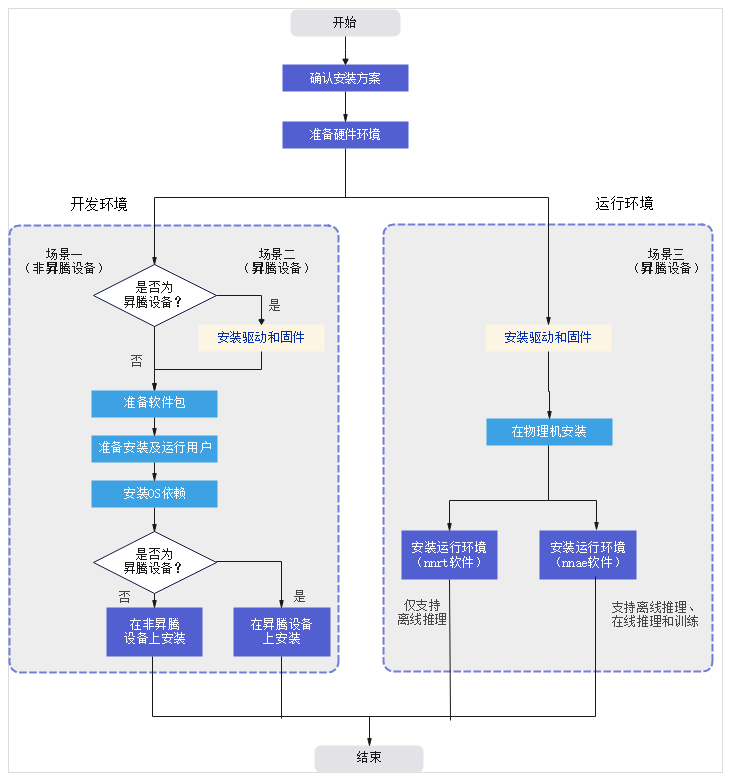

## 昇腾开发常用命令


## 安装驱动和固件
确认操作系统和内核版本
```
uname -m && cat /etc/*release
uname -r
```


创建驱动运行用户HwHiAiUser（运行驱动进程的用户），安装驱动时无需指定运行用户，默认即为HwHiAiUser
```
groupadd HwHiAiUser
useradd -g HwHiAiUser -d /home/HwHiAiUser -m HwHiAiUser -s /bin/bash
```


驱动安装
```
./Ascend-hdk-310p-npu-driver_23.0.rc1_linux-aarch64.run --full  --install-for-all
```

固件安装
```
./Ascend-hdk-310p-npu-firmware_6.3.0.1.241.run --full
```

查看 pci设备
```
lspci
```

## 安装cann



参考：[cann官方手册](https://www.hiascend.com/document/detail/zh/CANNCommunityEdition/63RC2alpha003/softwareinstall/instg/instg_000002.html)

