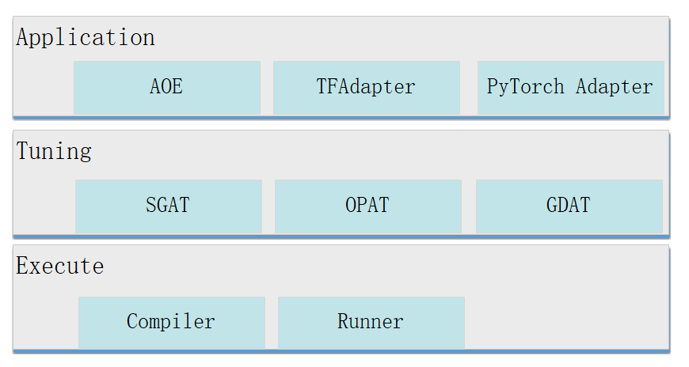
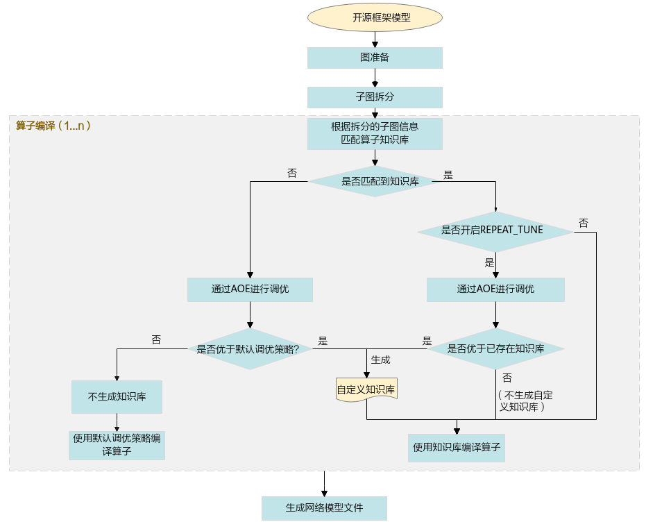

AOE自动调优

# 什么是AOE？
> 自动调优工具AOE，让模型在昇腾平台上高效运行

AOE（Ascend Optimization Engine）是一款自动调优工具，目的是为了充分利用有限的硬件资源，满足算子和整网的性能要求。

AOE通过生成调优策略、编译、在运行环境上验证的闭环反馈机制，不断迭代，最终得到最佳的调优策略，从而更充分利用硬件资源，提升网络的性能。

AOE的架构如下。



**Application层**：调优入口，支持如下。

- AOE：这里的AOE表示AOE进程，是离线推理场景下的调优入口。

- TFAdapter（TensorFlow Adapter）：TensorFlow训练场景下的调优入口。

- PyTorchAdapter（PyTorch Adapter）：PyTorch训练场景下的调优入口。

**Tuning层**：调优模式，支持以下类型。

- SGAT（SubGraph Auto Tuning）：子图调优。一张完整的网络，会被拆分成多个子图。针对每一个子图，通过SGAT生成不同的调优策略。SGAT的调优算法通过获取每个迭代的调优策略性能数据，找到最优的调优策略，从而实现对应子图的最优性能。

- OPAT（Operator Auto Tuning）：算子调优。AOE将一张整图输入给OPAT，OPAT内部进行算子融合，将融合得到的图进行算子粒度切分，针对每一个融合算子子图生成不同的算子调优策略，从而实现最优的算子性能。

- GDAT（Gradient Auto Tuning）：梯度调优。分布式训练场景下，GDAT通过最大化反向计算与梯度聚合通信并行度，缩短通信拖尾时间，提升集群训练的性能。

**Execute层**：为执行层，支持编译（Compiler）和在运行环境上运行（Runner）。

# AOE工作原理

如下以算子调优为例，介绍AOE的工作原理。



1. 将原始开源框架模型传入GE、FE进行图准备（InferShape、算子选择等）及子图拆分。

2. 进入算子编译阶段，根据拆分的子图信息匹配知识库。

**若能匹配到知识库：**

- 未开启REPEAT_TUNE的场景，直接使用已有知识库中的调优策略编译算子。
- 开启REPEAT_TUNE的场景，通过AOE进行调优。
  若调优后的结果优于当前已有的知识库，则会将调优后的结果存入用户自定义知识库，并使用自定义知识库中的调优策略编译算子。
  若调优后的结果不优于当前已有的知识库，则不再生成用户自定义知识库，直接使用已有的知识库编译算子。

**若未匹配到知识库，则通过AOE进行调优。**

- 若调优后的结果优于默认调优策略的性能，会将调优后的结果写入自定义知识库，并使用自定义知识库中的调优策略编译算子。
- 若调优后的结果不优于默认调优策略的性能，不生成自定义知识库，使用默认调优策略编译算子。

1. 推理场景下，编译完成后，生成适配昇腾AI处理器的离线模型文件。训练场景下，编译完成后，生成训练好的网络模型文件。

# AOE使用场景

当算子性能或者网络性能不佳时，可以使用AOE进行调优。AOE调优支持的场景如下：

- 离线推理
- TensorFlow训练
- PyTorch训练
- 在线推理
- IR构图

# 如何使用AOE进行调优？

如下以离线推理场景下Caffe网络的算子调优为例，介绍如何进行AOE调优。

1. 准备模型文件。

2. 配置环境变量。

**必选环境变量**

- CANN组合包提供进程级环境变量设置脚本，供用户在进程中引用，以自动完成环境变量设置。执行命令参考如下，以下示例均为root或非root用户默认安装路径，请以实际安装路径为准。

```
# 以root用户安装toolkit包
/usr/local/Ascend/ascend-toolkit/set_env.sh 
# 以非root用户安装toolkit包
${HOME}/Ascend/ascend-toolkit/set_env.sh 
```

- AOE工具依赖Python，以Python3.7.5为例，请以运行用户执行如下命令设置Python3.7.5的相关环境变量。

```
#用于设置python3.7.5库文件路径
export LD_LIBRARY_PATH=/usr/local/python3.7.5/lib:$LD_LIBRARY_PATH
#如果用户环境存在多个python3版本，则指定使用python3.7.5版本
export PATH=/usr/local/python3.7.5/bin:$PATH
```

**可选环境变量**

```
export ASCEND_DEVICE_ID=1
export TUNE_BANK_PATH=/home/HwHiAiUser/custom_tune_bank
export TE_PARALLEL_COMPILER=7
export REPEAT_TUNE=True
```

命令中的参数含义如下。
- ASCEND_DEVICE_ID：昇腾AI处理器的逻辑ID。
- TUNE_BANK_PATH：调优后自定义知识库的存储路径。
- TE_PARALLEL_COMPILER：开启算子的并行编译功能。
- REPEAT_TUNE：是否重新发起调优。

3. 进行AOE调优，命令如下。命令中使用的目录以及文件均为样例，请以实际为准。

```
aoe --framework=0 --model=$HOME/module/resnet50.prototxt --weight=$HOME/module/resnet50.caffemodel --job_type=2
```

命令中的参数含义如下。

--framework：原始网络模型的框架类型。0表示Caffee。

--model：原始模型文件路径与文件名。

--weight：原始模型权重文件路径与文件名。

--job_type：调优模式，2表示算子调优。

4. 若提示如下信息，则说明AOE调优完成。

```
Aoe process finished
```

调优完成后，生成文件如下。
-自定义知识库：若满足自定义知识库生成条件则会生成自定义知识库。

-om模型文件，存放路径为：

```
${WORK_PATH}/aoe_workspace/${model_name}_${timestamp}/tunespace/result/${model_name}_${timestamp}_tune.om
```

${WORK_PATH}：调优工作目录

${model_name}：模型名称

${timestamp}：时间戳

-算子调优结果文件：在执行调优的工作目录下实时生成命名为“aoe_result_opat_{timestamp}_{pid**xxx**}.json”的文件，记录调优过程中被调优的算子信息。示例如下。

```
"basic": {
      "tuning_name": "调优任务名",
      "tuning_time(s)": 1827
    }
    "OPAT": {
      "model_baseline_performance(ms)": 113.588725,
      "model_performance_improvement": "0.31%",
      "model_result_performance(ms)": 113.236731,
      "opat_tuning_result": "tuning successful",
      "repo_modified_operators": {
        "add_repo_operators": [
          {
            "op_name": "strided_slice_10",
            "op_type": "stridedsliced",
       ……
      "repo_summary": {
        "repo_add_num": 2,
        "repo_hit_num": 17,
        "repo_reserved_num": 15,
        "repo_unsatisfied_num": 0,
        "repo_update_num": 2,
        "total_num": 19
      }
```

5. 调优完成后，请使用调优后的自定义知识库重新推理，验证性能是否提高。