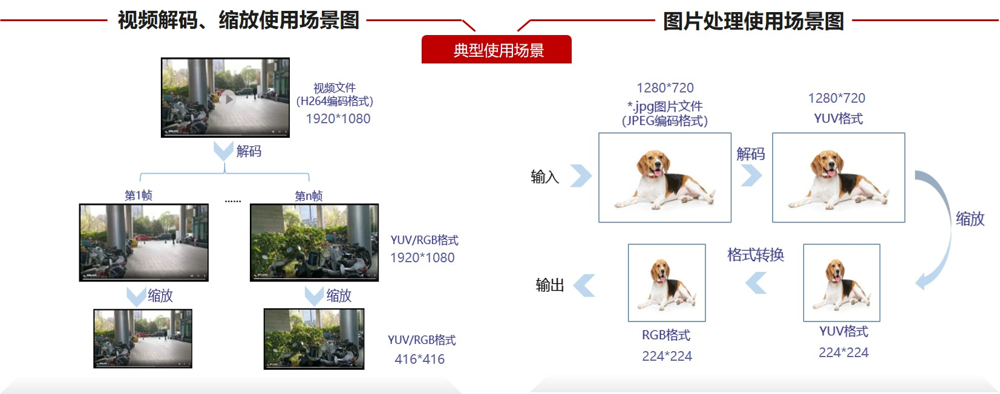
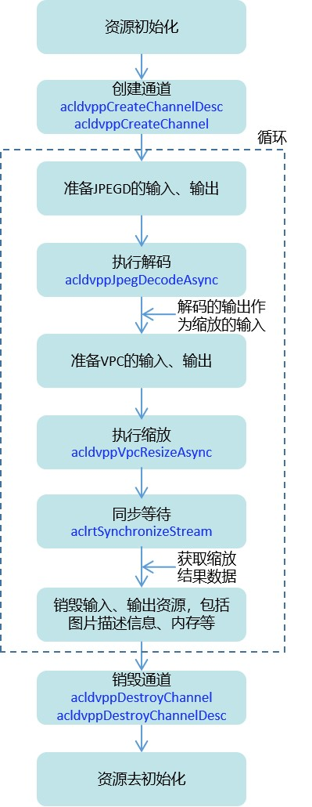

# 使用AIPP和DVPP

> 了解AscendCL数据预处理的两种方式：AIPP和DVPP

# 01 数据预处理的典型使用场景

受网络结构和训练方式等因素的影响，绝大多数神经网络模型对输入数据都有格式上的限制。在计算机视觉领域，这个限制大多体现在图像的尺寸、色域、归一化参数等。如果源图或视频的尺寸、格式等与网络模型的要求不一致时，我们需要对其处理，使其符合模型的要求，这个操作，一般称之为数据预处理。



# 02 AIPP、DVPP，它们都能做什么

CANN提供了两套专门用于数据预处理的方式：AIPP和DVPP。

| **处理方式**                                   | **描述**                                                     |
| ---------------------------------------------- | ------------------------------------------------------------ |
| AIPP（Artificial Intelligence Pre-Processing） | AIPP在AI Core上完成数据预处理，主要功能包括改变图像尺寸（抠图、填充等）、色域转换（转换图像格式）、减均值/乘系数（改变图像像素）等。AIPP区分为静态AIPP和动态AIPP，您只能选择其中一种方式，不支持两种方式同时配置。- 静态AIPP：模型转换时设置AIPP模式为静态，同时设置AIPP参数，模型生成后，AIPP参数值被保存在离线模型（*.om）中，每次模型推理过程采用固定的AIPP预处理参数，无法修改。 - 动态AIPP：模型转换时仅设置AIPP模式为动态，每次模型推理前，根据需求，在执行模型前设置动态AIPP参数值，然后在模型执行时可使用不同的AIPP参数。 |
| DVPP（Digital Vision Pre-Processing）          | DVPP是昇腾AI处理器内置的图像处理单元，通过AscendCL媒体数据处理接口提供强大的媒体处理硬加速能力，主要功能包括缩放、抠图、色域转换、图片编解码、视频编解码等。 |

总结一下，虽然都是数据预处理，但AIPP与DVPP的功能范围不同（比如DVPP可以做图像编解码、视频编解码，AIPP可以做归一化配置），处理数据的计算单元也不同，AIPP用的AI Core计算加速单元，DVPP就是用的专门的图像处理单元。

AIPP、DVPP可以分开独立使用，也可以组合使用。组合使用场景下，一般先使用DVPP对图片/视频进行解码、抠图、缩放等基本处理，但由于DVPP硬件上的约束，DVPP处理后的图片格式、分辨率有可能不满足模型的要求，因此还需要再使用AIPP进行色域转换、抠图、填充等处理。

例如，在昇腾310 AI处理器，由于DVPP仅支持输出YUV格式的图片，如果模型需要RGB格式的图片，则需要再使用AIPP进行色域转换。

# 03 如何使用AIPP功能

下文以此为例：测试图片分辨率为250*250、图片格式为YUV420SP，模型对图片的要求为分辨率224*224、图片格式为RGB，因此需要通过AIPP实现抠图、图片格式转换2个功能。关于各种格式转换，其色域转换系数都有模板，可从《ATC工具使用指南》获取，参见“[昇腾文档中心](https://www.hiascend.com/zh/document)”。

**静态AIPP**

1. 构造AIPP配置文件*.cfg。

    抠图：有效数据区域从左上角(0, 0)像素开始，抠图宽*高为224*224。

    图片格式转换：输入图片格式为YUV420SP_U8，输出图片格式通过色域转换系数控制。

    ```
    aipp_op {
    aipp_mode : static # AIPP配置模式
    input_format : YUV420SP_U8 # 输入给AIPP的原始图片格式
    src_image_size_w : 250 # 输入给AIPP的原始图片宽高
    src_image_size_h : 250
    crop: true # 抠图开关，用于改变图片尺寸
    load_start_pos_h: 0 # 抠图起始位置水平、垂直方向坐标
    load_start_pos_w: 0
    crop_size_w: 224 # 抠图宽、高
    crop_size_h: 224
    csc_switch : true # 色域转换开关
    matrix_r0c0 : 256 # 色域转换系数
    matrix_r0c1 : 0
    matrix_r0c2 : 359
    matrix_r1c0 : 256
    matrix_r1c1 : -88
    matrix_r1c2 : -183
    matrix_r2c0 : 256
    matrix_r2c1 : 454
    matrix_r2c2 : 0
    input_bias_0 : 0
    input_bias_1 : 128
    input_bias_2 : 128
    }
    ```

2. 使能静态AIPP。

    使用ATC工具转换模型时，可将AIPP配置文件通过insert_op_conf参数传入，将其配置参数保存在模型文件中。

    ```
    atc --framework=3 --soc_version=${soc_version}
    --model= $HOME/module/resnet50_tensorflow.pb
    --insert_op_conf=$HOME/module/insert_op.cfg
    --output=$HOME/module/out/tf_resnet50
    ```

    参数解释如下：
    - framework：原始网络模型框架类型，3表示TensorFlow框架。

    - soc_version：指定模型转换时昇腾AI处理器的版本，例如Ascend310。

    - model：原始网络模型文件路径，含文件名。

    - insert_op_conf：AIPP预处理配置文件路径，含文件名。

    - output：转换后的*.om模型文件路径，含文件名，转换成功后，文件名自动以.om后缀结尾。

3. 调用AscendCL接口加载模型，执行推理。

    可参考往期的技术文章，请参见“[基于昇腾计算语言AscendCL开发AI推理应用](https://www.hiascend.com/zh/developer/techArticles/20230214-1?envFlag=1)”。

**动态AIPP**

1. 构造AIPP配置文件*.cfg。

    ```
    aipp_op
    {
    aipp_mode: dynamic
    max_src_image_size: 752640 # 输入图像最大内存大小，需根据实际情况调整
    }
    ```

2. 使能动态AIPP。

    使用ATC工具转换模型时，可将AIPP配置文件通过insert_op_conf参数传入，将其配置参数保存在模型文件中。

    ```
    atc --framework=3 --soc_version=${soc_version}
    --model= $HOME/module/resnet50_tensorflow.pb
    --insert_op_conf=$HOME/module/insert_op.cfg
    --output=$HOME/module/out/tf_resnet50
    ```

    参数解释如下：
    - framework：原始网络模型框架类型，3表示TensorFlow框架。
    - soc_version：指定模型转换时昇腾AI处理器的版本，例如Ascend310。
    - model：原始网络模型文件路径，含文件名。
    - insert_op_conf：AIPP预处理配置文件路径，含文件名。
    - output：转换后的*.om模型文件路径，含文件名，转换成功后，文件名自动以.om后缀结尾。
3. 调用AscendCL接口加载模型，设置AIPP参数后，再执行推理。

    模型加载、执行可从参考往期的技术文章，请参见“[基于昇腾计算语言AscendCL开发AI推理应用](https://www.hiascend.com/zh/developer/techArticles/20230214-1?envFlag=1)”。

    调用AscendCL接口设置AIPP参数的代码示例如下：

    ```
    aclmdlAIPP *aippDynamicSet = aclmdlCreateAIPP(batchNumber);
    aclmdlSetAIPPSrcImageSize(aippDynamicSet, 250, 250);
    aclmdlSetAIPPInputFormat(aippDynamicSet, ACL_YUV420SP_U8);
    aclmdlSetAIPPCscParams(aippDynamicSet, 1, 256, 0, 359, 256, -88, -183, 256, 454, 0, 0, 0, 0, 0, 128, 128);
    aclmdlSetAIPPCropParams(aippDynamicSet, 1, 2, 2, 224, 224, 0);
    aclmdlSetInputAIPP(modelId, input, index, aippDynamicSet);
    aclmdlDestroyAIPP(aippDynamicSet);
    ```

# 04 如何使用DVPP功能

昇腾AI处理器内置图像处理单元DVPP，提供了强大的媒体处理硬加速能力。同时，异构计算架构CANN提供了使用图像处理硬件算力的入口：AscendCL接口，开发者可通过接口来进行图像处理，以便利用昇腾AI处理器的算力。

DVPP内的功能模块如下所示。

| **功能模块**                     | **描述**                                                     |
| -------------------------------- | ------------------------------------------------------------ |
| VPC（Vision Preprocessing Core） | 处理YUV、RGB等格式的图片，包括缩放、抠图、色域转换、直方图统计等。 |
| JPEGD（JPEG Decoder）            | JPEG压缩格式-->YUV格式的图片解码。                           |
| JPEGE（JPEG Encoder）            | YUV格式-->JPEG压缩格式的图片编码。                           |
| VDEC（Video Decoder）            | H264/H265格式-->YUV/RGB格式的视频码流解码。                  |
| VENC（Video Encoder）            | YUV420SP格式-->H264/H265格式的视频码流编码。                 |
| PNGD（PNG decoder）              | PNG格式-->RGB格式的图片解码。                                |

此处就以JPEGD图片解码+VPC图片缩放为例来说明如何使用DVPP功能。这里先通过一张图总览接口调用流程，包括资源初始化&去初始化、通道创建与销毁、解码、缩放、等待任务完成、释放内存资源等。




总览接口调用流程后，接下来我们以开发者更熟悉的方式“代码”来展示JPEGD图片解码+VPC图片缩放功能的关键代码逻辑。

```
// 创建通道
acldvppChannelDesc dvppChannelDesc = acldvppCreateChannelDesc();
acldvppCreateChannel(dvppChannelDesc);

// 在JPEGD图片解码前，准备其输入、输出
// …… 
// 创建解码输出图片描述信息，设置输出图片的宽、高、图片格式、内存地址等
acldvppPicDesc decodeOutputDesc = acldvppCreatePicDesc();
acldvppSetPicDescData(decodeOutputDesc, decodeOutputBuffer));
acldvppSetPicDescWidth(decodeOutputDesc, decodeOutputWidth);
acldvppSetPicDescHeight(decodeOutputDesc, decodeOutputHeight);
// 此处省略其它set接口……

// 执行JPEGD图片解码
acldvppJpegDecodeAsync(dvppChannelDesc, decodeInputBuffer, decodeInputBufferSize, decodeOutputDesc, stream);

// 5. 在VPC图片缩放前，准备其输入、输出
// 创建缩放输入图片的描述信息，并设置各属性值，解码的输出作为缩放的输入
acldvppPicDesc resizeInputDesc = acldvppCreatePicDesc();
acldvppSetPicDescData(resizeInputDesc, decodeOutputBuffer);
acldvppSetPicDescWidth(resizeInputDesc, resizeInputWidth);
acldvppSetPicDescHeight(resizeInputDesc, resizeInputHeight);
// 此处省略其它set接口……

// 创建缩放输出图片的描述信息，并设置各属性值
acldvppPicDesc resizeOutputDesc = acldvppCreatePicDesc();
acldvppSetPicDescData(resizeOutputDesc, resizeOutputBuffer);
acldvppSetPicDescWidth(resizeOutputDesc, resizeOutputWidth);
acldvppSetPicDescHeight(resizeOutputDesc, resizeOutputHeight);
// 此处省略其它set接口……

// 6. 执行VPC图片缩放
acldvppVpcResizeAsync(dvppChannelDesc, resizeInputDesc,
                     resizeOutputDesc, resizeConfig, stream);

// 7. JPEGD图片解码、VPC图片缩放都是异步任务，需调用以下接口阻塞程序运行，直到指定Stream中的所有任务都完成
aclrtSynchronizeStream(stream);
```

本节通过接口调用流程、示例代码带大家了解了DVPP的功能开发，更多DVPP的功能介绍及使用请参见“[昇腾文档中心](https://www.hiascend.com/zh/document)”。