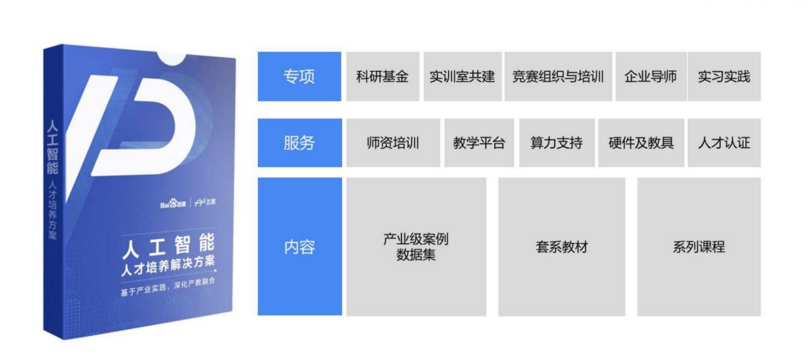
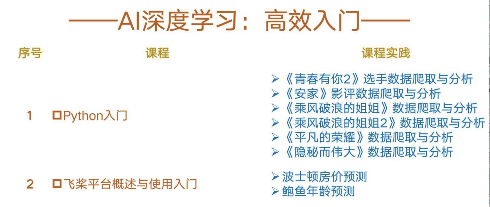
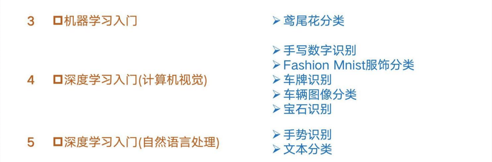
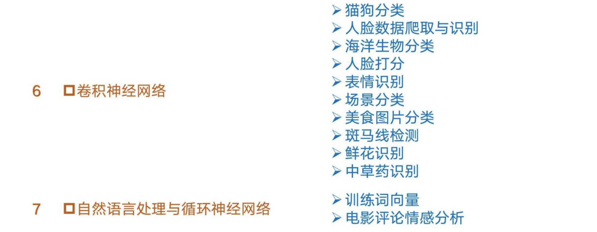
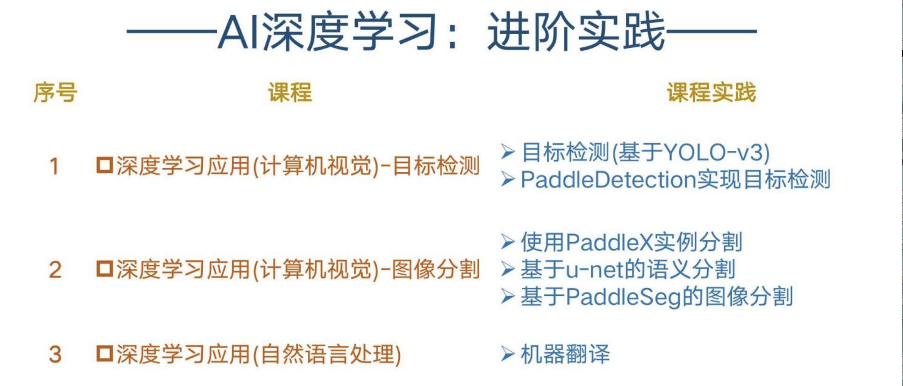
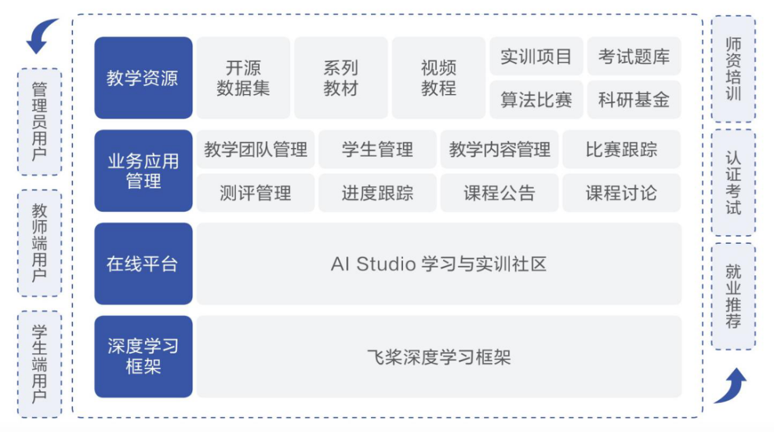
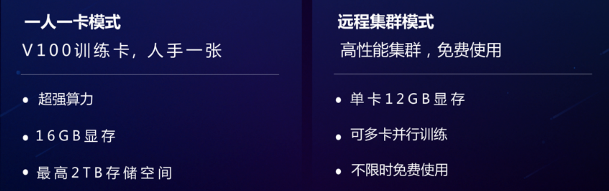
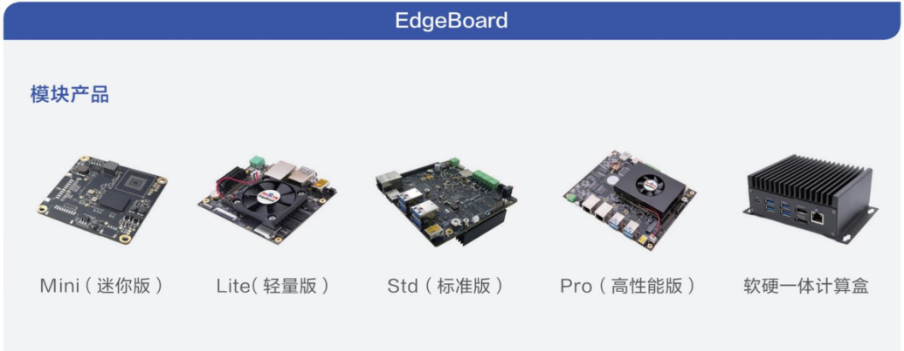
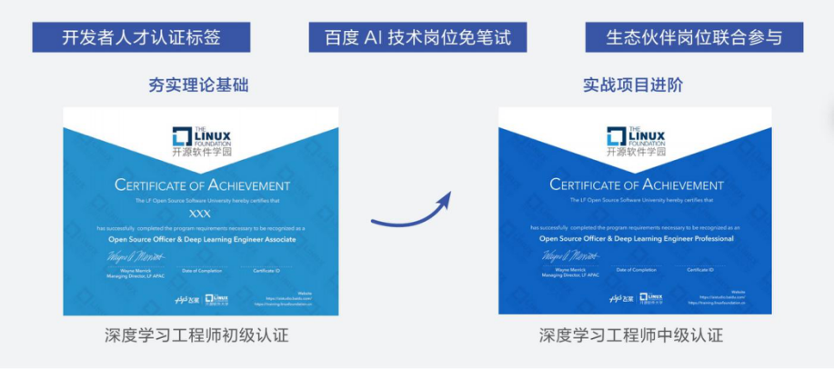
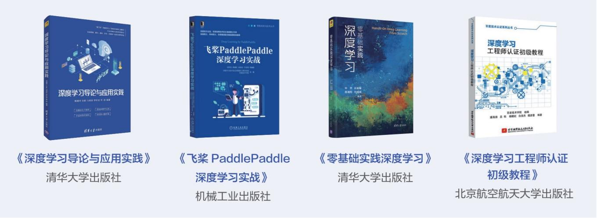

# 一站式Paddle教育资源大放送

为响应国家人工智能发展战略，支持高校人工智能专业乃至学院建设，百度在人工智能类技术以及行业深入探索，力争为高校提供一套涵盖教学体系、教学大纲、教学方案、教材、教学教研产品等的完整的、全流程、全体系的人工智能解决方案。着力为推进高校快速建立人工智能专业及人工智能人才培养和就业提供生态环境，包括教学、科研、人才拓展、应用场景等多个方面的服务体系，涵盖机器学习、计算机视觉、自然语言处理、语音识别等多个领域，将项目应用开发和教学科研紧密结合，打造覆盖人工智能全行业的高质量复合型、创新型、应用型人才。

### **资源一：体系化深度学习教学资源包**

历经三年打磨，在500 多所高校 2000 多位一线教师的见证及协助优化下，百度飞桨打造了一批质量精良的明星课程。提供开设AI深度学习课程所需的全套教学资源，包含：课件PPT+实践案例+教参视频，一站式解决高校与教育机构教研困难、案例不足、师资匮乏等难题，且月维度补充更新。 

 

### **资源二：百度深度学习在线教育平台（AI Studio教育版）**

作为国内领先的 AI 技术公司，百度注重 AI 技术发展的同时，亦关注行业人才的培养。为此，百度依托深度学习框架飞桨，开发了 AI Studio 学习与实训社区。历经两年打磨，于2020年入选教育部协同育人专家组疫情期间向高校推荐的 20 个教学平台之一，被评为 2020 年度优秀软件教育平台。

### **资源三：亿元GPU算力支持计划**

飞桨PaddlePaddle正式发布了亿元算力支持计划，以AI Studio一站式深度学习开发平台为载体，开放价值一亿元的免费算力资源，意在帮助深度学习技术的初学者和开发者, 迅速掌握深度学习技术；帮助高校与教育机构，破除算力桎梏、降低教与学的门槛。

### **资源四：硬件教具**

实践教具 EdgeBoard 助力理论实践相结合。基于 EdgeBoard 计算卡打造的通用 AI 边缘计算盒，可直接应用于 AI 项目研发与部署。无缝衔接百度大脑开放的 AI 能力，海量 AI 技能自由选择，支持硬件定制，支持多模型、高精度模型部署。

详情介绍：https://ai.baidu.com/tech/hardware/edgeboard

### **资源五：专业且体系化的在线视频教程**

经过多年积累，百度沉淀了超过5000分钟的在线教学视频，从深度学习基础知识，到进阶实战应用。不仅支持学生在线学习，也欢迎各方在平台上开设属于自己的视频教程。

#### **预备知识**

Python小白逆袭大神

https://aistudio.baidu.com/aistudio/course/introduce/1224

数据准备和特征工程

https://aistudio.baidu.com/aistudio/course/introduce/1337

机器学习的思考故事

https://aistudio.baidu.com/aistudio/course/introduce/1138

#### **基础入门**

百度架构师手把手带你零基础实践深度学习

https://aistudio.baidu.com/aistudio/course/introduce/1297

深度学习7日入门-CV疫情特辑

https://aistudio.baidu.com/aistudio/course/introduce/1149

基于深度学习的自然语言处理

https://aistudio.baidu.com/aistudio/course/introduce/24177

高层API助你快速上手深度学习

https://aistudio.baidu.com/aistudio/course/introduce/6771

#### **实战进阶**

目标检测7日打卡营

https://aistudio.baidu.com/aistudio/course/introduce/1617

图像分割7日打卡营

https://aistudio.baidu.com/aistudio/course/introduce/1767

强化学习7日打卡营-世界冠军带你从零实践

https://aistudio.baidu.com/aistudio/course/introduce/1335

图神经网络7日打卡营

https://aistudio.baidu.com/aistudio/course/introduce/1956

生成对抗网络七日打卡营

https://aistudio.baidu.com/aistudio/course/introduce/16651

 

#### **飞桨人工智能师资培训课程**

https://aistudio.baidu.com/aistudio/education/train

 

### **资源六：源于工业实践的深度学习工程师能力评估体系，以及人才认证体系**

为了助力深度学习工程师的职业发展，百度飞桨与LinuxFoundation开源软件学园合作推出国内首个深度学习工程师联合认证。现已开通人才招募“绿色通道”，通过认证的开发者将获得认证标签并被纳入AI专项人才库，百度AI技术岗位可以免笔试应聘，相关生态合作企业技术岗位也可优先录用。

### **资源七：教材教辅**

面对国家人工智能发展战略对人才需求的挑战，百度飞桨综合分析高校人才培养需求，结合飞桨自身技术优势，规划出版人工智能系列教材及配套数字资源，推动高校人工智能专业课程建设，构建人工智能教育体系，促进人工智能人才培养。

教材由高校知名教授、百度资深技术专家共同合作编写，发挥多方在教育界、人工智能产业界的优势，理论与实践融合，编写面向未来技术演进与行业发展的系列人工智能教材。教材体系构建完备，构建了从基础理论、核心技术到行业应用的人工智能知识框架，同时考虑到教学需求，采用教材、课件、慕课、数字课程、习题以及实验一体化设计，助力线上线下融合课程建设和教学模式改革。

此外，针对部分技术难点，飞桨已出版多本单行本教材教辅，可辅助高校人才培养并为社会开发者提供教育支持。

您可在线上直接购买书籍：

深度学习导论与应用实践https://item.jd.com/12578787.html

零基础实践深度学习https://item.jd.com/12779747.html

 